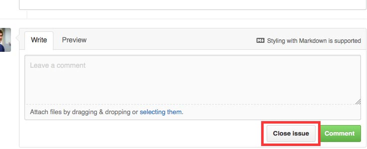

# Lunch.js Champion Guide 🍔🍟🌮🌯🍜🍎🌭🍕 
So you want to champion a lunch.js event? Great! It's really simple, all you have to do is create and manage a GitHub issue! (and go to lunch of course)

## Never used Github before?
* See this page for setting up and signing into github: [Signing up for a new GitHub account](https://help.github.com/articles/signing-up-for-a-new-github-account/)
  * Be sure to check out the "next steps" section at the bottom of the page
* See this page for help creating a github issue:
[Creating an issue](https://help.github.com/articles/creating-an-issue/)

## What is this all about?
Lunch.js is a monthly neighborhood centric lunch time meetup. This can be an opportunity to...
* Meet other developers that work in your part of town
* Find a mentor to help level up your carrer
* Find a mentee to drop some knowledge on
* Pick the brain of a Sr. Developer
* Have heated discussions about which framework is better (actually, please don't do this)

As of now lunch.js meets on the first Tuesday of every month at 12:30.
Check the [issues](https://github.com/jsla/lunch.js/issues) for tickets about upcoming lunch.js events.
There is no need to "RSVP" just simply comment on the issue that you would like to attend!

## So (as a champion) what do I have to do?
The main responsibilities of a lunch champion are as follows,

* Create and manage a GitHub Issue for the location you are Champion of
* Selecting a location for lunch. (Or select options for everyone to vote on)
* Let everyone know which location was selected.
* Make sure people can find each other at the event.
* Take a picture with everyone and [tweet to js.la](https://twitter.com/jsdotla) (optional)
* Close the GitHub issue after you lunch event has ended.
* Champion the next month, or find a new champion to take your place.

### Creating the issue
Starting a lunch begins with clicking the `START A LUNCH` button on http://lunch.js.la which
will take you to the "create a new issue" page, [https://github.com/jsla/lunch.js/issues/new](https://github.com/jsla/lunch.js/issues/new)

As you'll see we already have an [issue template](./ISSUE_TEMPLATE.md) to get you started.
Make sure you put the date and general location (DTLA, West Hollywood, South Bay, etc.) in the title.
Be sure to keep the most up-to-date information is in the main ticket comment. If the location changes
or voting is going on make sure that is reflected in the issue.
Keeping this information up to date helps avoid confusion. If there has been discussion
about where to meet for lunch it can be confusing to read through the conversation and
figure out what the final decision was, especially if it is noon on lunch.js day!

In short
* Create the issue as soon as possible after the previous lunch.js
* Only have one issue per location open at a time
* Make sure the information is current
* Use issue labels to give info at a glance
* Make sure the time and place are in bold and easy to read
* Include Yelp or Google Maps links for getting easy directions

### Selecting a location for lunch
Try to pick a place with a reasonable price range (~$10 - ~$15) to accommodate as
many participants as possible. Places that are cafeteria style (order at a counter and self seat) typically work best. If you have a big group you may want to find a place that will be more accomadating or in a worst case, break into smaller groups and sit at multiple tables.

In short
* It's OK to meet at the same place every time if that's what people want to do
* Locations where you order at a counter and seat yourself work best
* Provide up to 3 locations for voting
  * Be sure to use reaction emojis so people don't have to write a comment
  * If your neighborhood covers a large area vary the locations around town
* Finalize the location no later than the Friday before the lunch.js day

### So it's time to meet for lunch
On lunch.js day it is good to put a comment on the issue with what you are wearing and where
you will be meeting everyone. Try to get there a little early and get as much of the group
together as possible before walking into the restaurant. In addition to keeping an eye out
for issue comments from attendees you can use the [js.la slack channel](https://jsla.slack.com/)
([join here](https://js.la/slack)) for more real time communication with your lunch friends.

In short
* Get there early if you can!
* Comment on the ticket with info on where to find you
* Lock down a table (if self seating style place)
  * Bring a friend from work who can order for you if need be
* Introduce yourself
* Try to foster conversation
* Encourage large groups from a single office **not** to sit together

### Don't forget to close the issue after the event has ended
If you take a picture be sure to post it for everyone with a nice comment when closing the issue.

### Finding a new champion
If you don't have the time to champion every month ask around at lunch for someone who might be
interested in getting involved. Most people think this is much more work than it is so reassure
them how easy it is to organize a lunch.js event. If you and a coworker go regularly feel free
to "co-champion" an event.

* Ask around at your event
* Create an issue for finding a new champion
* Ask someone to help "co-champion" the next event to get their feet wet
* Reach out in the [js.la slack](http://jsla.slack.com) ([join here](https://js.la/slack))
* Contact a [js.la organizer](./CHAMPIONS.md#champion-organizers)

### Sounds great! Where do I start
If your area doesn't have an event or champion go ahead and create a ticket!
To be able to apply labels you'll need to be added as a contributor to the repo.
Simply mention @ashwell, @davidguttman, @rouzbeh84 or another [js.la organizer](https://js.la/team)
in your new ticket to be added as a contributor.

