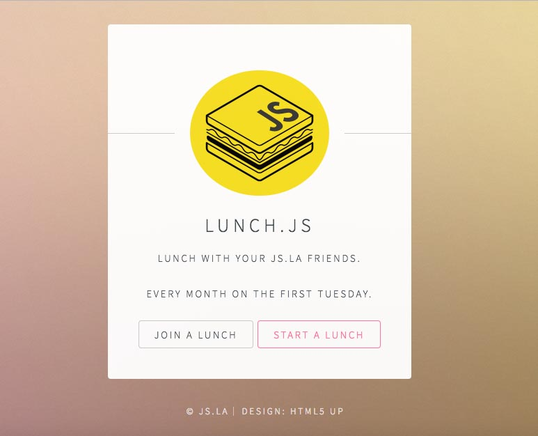

# 🍔🍟🌮🌯🍜🍎🌭🍕   Lunch.js Champion Guide 🍔🍟🌮🌯🍜🍎🌭🍕 
So you want to champion a lunch.js event? Great! It's really simple, all you have to do is create and manage a GitHub issue!

## Never used Github before?
* See this page for setting up and signing into github: [Signing up for a new GitHub account](https://help.github.com/articles/signing-up-for-a-new-github-account/)
* See this page for creating a github issue:
[Creating an issue](https://help.github.com/articles/creating-an-issue/)

## What is this all about?
Lunch.js is a monthly neighborhood centric lunch time meetup. This can be an opportunity to...

As of now lunch.js meets on the first Tuesday of every month at 12:30
Check the [issues](https://github.com/jsla/lunch.js/issues) for tickets about upcoming lunch.js events.

## So what do I have to do?
The main responsibilities of a lunch champion are as follows,

* Create and manage a GitHub Issue for the location you are Champion of
* Selecting a location for lunch.
* Close the GitHub issue after you lunch event has ended.
* Champion the next month, or find a new champion to take your place.

### Creating the issue
Starting a lunch begins with clicking the `START A LUNCH` button on the
main page:

As you'll see we already have an [issue template](./ISSUE_TEMPLATE.md) to get you started.
Just make sure you put the date in the title along with the location. Make sure that the
most up to date information is in the ticket. If the location changes or voting is going on
make sure that is reflected in the main ticket comment. Keeping this information up to date
helps avoid confusion. If there has been discussion about where to meet for lunch it can
be confusing to read through the conversation and figure out what the final decision was, 
especially if it is noon on lunch.js day!

In short
* Create the issue as soon as possible after the previous lunch.js
* Only have one issue per location open at a time
* Make sure the information is current
* Make sure time and places are bold and easy to read
* Include Yelp or Google Maps links for getting easy directions

### Selecting a location for lunch
Try to pick a place with a reasonable price range (~$10 - ~$15) so to accommodate as
many participates as possible.

In short
* It's OK to meet at the same place every time if that's what people want to do
* Locations where you order at a counter and seat yourself work best
* Use labels to give info at a glance
* Provide up to 3 locations for voting
  * Be sure to use reaction emojis so people don't have to write a comment
  * If your neighborhood covers a large area vary the locations around town
* Finalize the location no later than the Friday before the lunch.js day

### So it's time to meet for lunch

In short
* Get there early if you can!
* Comment on the ticket with info on where to find you
* Lock down a table
  * Bring a friend from work who can order for you if need be
* Introduce yourself
* Try to foster conversation
* Encourage large groups from a single office to not sit together

### Don't forget to close the issue after the event has ended

### Finding a new champion

* Ask at your event
* Create an issue for finding a new champion
* Contact a js.la organizer

### Sounds great! Where do I start
If your area doesn't have an event or champion go ahead and create a ticket!
To be able to apply labels you'll need to be added as a contributor to the repo.
Simply mention @ashwell, @davidguttman, @seanwestfall or another js.la organizer in your new ticket to be added as a contributor.
